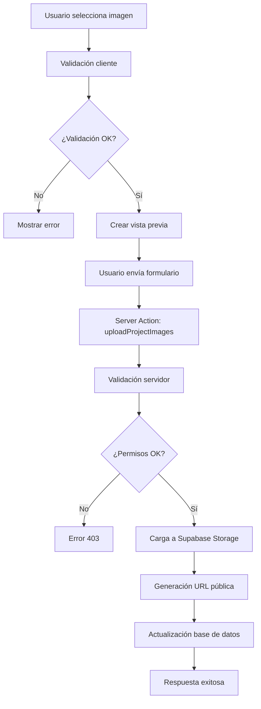
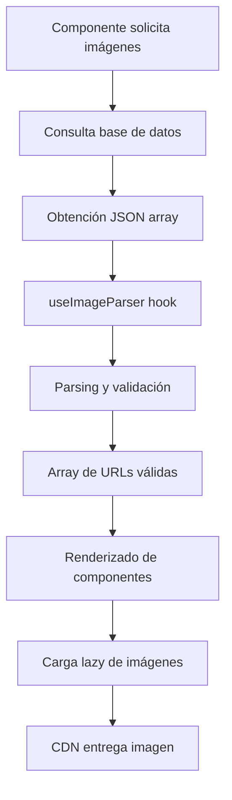
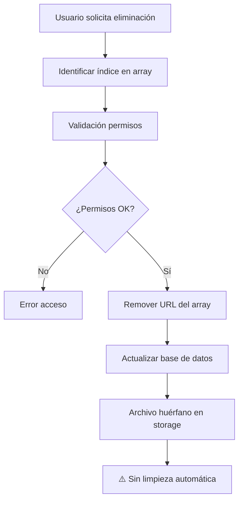

# Sistema de Gestión de Imágenes - Plataforma Domera

## Resumen Ejecutivo

La plataforma Domera utiliza un sistema de gestión de imágenes basado en Supabase Storage con integración AWS S3, diseñado para manejar imágenes de proyectos, unidades, organizaciones y usuarios. El sistema almacena URLs de imágenes como arrays JSON en la base de datos PostgreSQL y utiliza un CDN público para la entrega de contenido.

---

## 1. Arquitectura de Base de Datos

### 1.1 Esquema de Almacenamiento de Imágenes

**Ubicación**: `prisma/schema.prisma`

```prisma
model Project {
  id      String @id @default(cuid())
  images  Json   // Array de URLs de imágenes
  // ... otros campos
}

model Unit {
  id         String  @id @default(cuid())
  images     Json    // Array de URLs de imágenes
  floorPlanUrl String? // URL separada para planos
  // ... otros campos
}

model Organization {
  id      String  @id @default(cuid())
  logoUrl String? // URL del logo de la organización
  // ... otros campos
}

model User {
  id        String  @id @default(cuid())
  avatarUrl String? // URL del avatar del usuario
  // ... otros campos
}

model Document {
  id      String @id @default(cuid())
  fileUrl String // URL del archivo (incluye imágenes como documentos)
  // ... otros campos
}
```

### 1.2 Estructura de Datos de Imágenes

**Proyectos y Unidades**:
- Las imágenes se almacenan como arrays JSON de URLs
- **Índice 0**: Imagen placeholder/principal
- **Índice 1**: Imagen principal del proyecto/unidad
- **Índice 2+**: Imágenes adicionales del carrusel/galería

**Organizaciones y Usuarios**:
- Almacenan una sola URL como string
- Sin arrays, gestión individual de imágenes

---

## 2. Infraestructura de Almacenamiento

### 2.1 Configuración de Supabase Storage

**Ubicación**: `src/lib/supabase/storage.ts`

```typescript
// Configuración del cliente de Supabase Storage
const supabase = createClient(
  process.env.NEXT_PUBLIC_SUPABASE_URL!,
  process.env.SUPABASE_SERVICE_ROLE_KEY!
)

// Bucket principal: "files"
// Acceso público: Todas las imágenes son públicamente accesibles
// CDN: URLs optimizadas para entrega rápida
```

### 2.2 Estructura de Carpetas

**Organización del bucket `files`**:
```
files/
├── projects/
│   └── {projectId}/
│       ├── imagen1.jpg
│       ├── imagen2.png
│       └── ...
├── units/
│   └── {unitId}/
│       ├── unit_image1.jpg
│       └── floor_plan.pdf
├── organizations/
│   └── {orgId}/
│       └── logo.png
└── avatars/
    └── {userId}/
        └── profile.jpg
```

### 2.3 Convenciones de Nomenclatura

**Patrón de nombres**: `{timestamp}_{randomSuffix}_{sanitizedOriginalName}`

Ejemplo: `1692345678901_abc123_imagen_proyecto_vista_frontal.jpg`

---

## 3. Flujo de Carga de Imágenes

### 3.1 Validación del Cliente

**Ubicación**: `src/lib/utils/images.ts`

```typescript
// Límites de tamaño de archivo
const IMAGE_SIZE_LIMIT = 10 * 1024 * 1024 // 10MB para imágenes
const DOCUMENT_SIZE_LIMIT = 20 * 1024 * 1024 // 20MB para documentos

// Formatos permitidos
const ALLOWED_IMAGE_TYPES = ['image/jpeg', 'image/jpg', 'image/png', 'image/webp', 'image/avif']

// Validación antes del envío
export function validateImageFile(file: File): ValidationResult {
  // Verificar tamaño
  // Verificar tipo MIME
  // Verificar extensión
}
```

### 3.2 Procesamiento de Carga

**Ubicación**: `src/lib/actions/storage.ts`

**Límites por Entidad**:
- **Proyectos**: Máximo 20 imágenes
- **Unidades**: Máximo 15 imágenes
- **Organizaciones**: Máximo 10 imágenes (solo admin)
- **Avatares**: Máximo 2MB, archivo único

**Flujo de Procesamiento**:
1. Validación de permisos de usuario
2. Validación de archivos (tamaño, tipo, límites)
3. Generación de rutas únicas
4. Carga a Supabase Storage
5. Generación de URLs públicas
6. Actualización de base de datos

```typescript
// Ejemplo de carga batch para proyectos
export async function uploadProjectImages(
  projectId: string,
  files: File[]
): Promise<UploadResult[]> {
  // Validar límites (max 20 imágenes)
  // Procesar cada archivo individualmente
  // Manejo granular de errores
  // Retornar array de resultados
}
```

### 3.3 Capa de Acceso a Datos

**Ubicación**: `src/lib/dal/storage.ts`

```typescript
// Carga directa a S3 usando AWS SDK
export async function uploadToS3(
  file: File,
  path: string
): Promise<string> {
  // Configuración de AWS S3
  // Validación final del archivo
  // Carga con metadatos
  // Retorno de URL pública
}

// Procesamiento batch con control de errores
export async function batchUpload(
  files: File[],
  basePath: string
): Promise<BatchUploadResult> {
  // Carga paralela con límite de concurrencia
  // Seguimiento individual de estado
  // Prevención de condiciones de carrera
}
```

---

## 4. Arquitectura de Componentes de Carga

### 4.1 Componentes Principales

**Ubicación**: `src/components/image-upload/`

#### ImageUpload.tsx
- **Propósito**: Carga individual de imágenes con drag-and-drop
- **Características**:
  - Interfaz de arrastrar y soltar
  - Vista previa en tiempo real
  - Validación instantánea
  - Indicadores de progreso

#### BatchImageUpload.tsx
- **Propósito**: Carga múltiple con seguimiento de estado
- **Características**:
  - Carga de múltiples archivos
  - Estado individual por imagen
  - Capacidad de eliminación selectiva
  - Manejo de errores granular

#### ImageArrayUpload.tsx
- **Propósito**: Gestión de arrays de imágenes existentes
- **Características**:
  - Edición de arrays JSON
  - Reordenamiento de imágenes
  - Eliminación selectiva
  - Integración con formularios

#### OptimizedImageUpload.tsx
- **Propósito**: Carga avanzada con modo diferido
- **Características**:
  - Modo diferido para integración con formularios
  - Optimización de memoria
  - Limpieza automática de URLs temporales
  - Manejo avanzado de estados

### 4.2 Hook de Gestión de Estado

**Ubicación**: `src/hooks/useBatchImageUpload.ts`

```typescript
export function useBatchImageUpload() {
  // Estado de archivos seleccionados
  const [files, setFiles] = useState<File[]>([])
  const [uploadStatuses, setUploadStatuses] = useState<UploadStatus[]>([])
  const [isUploading, setIsUploading] = useState(false)

  // Funciones de gestión
  const addFiles = useCallback((newFiles: File[]) => {
    // Validación y agregado de archivos
    // Prevención de duplicados
  }, [])

  const removeFile = useCallback((index: number) => {
    // Eliminación con limpieza de memoria
    // Revocación de URLs de blob
  }, [])

  const uploadAll = useCallback(async () => {
    // Carga batch con control de concurrencia
    // Actualización de estado en tiempo real
    // Manejo de errores individuales
  }, [])

  return {
    files,
    uploadStatuses,
    isUploading,
    addFiles,
    removeFile,
    uploadAll
  }
}
```

---

## 5. Sistema de Visualización de Imágenes

### 5.1 Componentes de Visualización de Proyectos

#### ProjectImageCarousel.tsx
**Ubicación**: `src/components/custom-ui/ProjectImageCarousel.tsx`

```typescript
// Carrusel de pantalla completa con navegación
export function ProjectImageCarousel({ images }: { images: string[] }) {
  // Navegación con teclado y mouse
  // Vista modal de pantalla completa
  // Indicadores de posición
  // Carga lazy de imágenes
}
```

#### ProjectCard.tsx
**Ubicación**: `src/app/(landing)/projects/_components/ProjectCard.tsx`

```typescript
// Tarjeta de proyecto con imagen principal
export function ProjectCard({ project }: { project: Project }) {
  const images = useImageParser(project.images)
  const mainImage = images[1] || images[0] || '/placeholder.jpg'
  
  // Manejo de imágenes fallback
  // Aspect ratio consistente
  // Optimización de carga
}
```

#### ProjectHero.tsx
**Propósito**: Sección principal de showcase del proyecto
- Imagen destacada de gran tamaño
- Overlay con información del proyecto
- Diseño responsivo para múltiples dispositivos

### 5.2 Componentes de Visualización de Unidades

#### UnitGallery.tsx
**Ubicación**: `src/app/(landing)/projects/[slug]/units/[unitId]/_components/UnitGallery.tsx`

```typescript
// Galería de imágenes en cuadrícula
export function UnitGallery({ unit }: { unit: Unit }) {
  const images = useImageParser(unit.images)
  
  // Layout de cuadrícula responsivo
  // Modal de imagen expandida
  // Navegación entre imágenes
}
```

#### UnitImageDisplay.tsx
**Propósito**: Presentación principal de imagen de unidad
- Imagen primaria destacada
- Navegación a galería completa
- Información superpuesta de la unidad

### 5.3 Manejo Responsivo de Imágenes

**Clases CSS Utilizadas**:
```css
/* Aspect ratios consistentes */
.aspect-video { aspect-ratio: 16 / 9; }
.aspect-square { aspect-ratio: 1 / 1; }
.aspect-[4/3] { aspect-ratio: 4 / 3; }

/* Ajuste de imágenes */
.object-cover { object-fit: cover; }
.object-contain { object-fit: contain; }

/* Placeholders para imágenes faltantes */
.bg-gray-200 { background-color: #e5e7eb; }
```

---

## 6. Gestión de Imágenes en Formularios

### 6.1 Formularios de Creación de Proyectos

**Ubicación**: `src/components/create-project-form/project-images/`

#### ProjectMainImageForm.tsx
```typescript
// Selección de imagen principal con vista previa
export function ProjectMainImageForm() {
  // Estado local de imagen seleccionada
  const [selectedImage, setSelectedImage] = useState<File | null>(null)
  const [previewUrl, setPreviewUrl] = useState<string>('')
  
  // Modo diferido: imagen seleccionada pero no cargada
  // Vista previa en tiempo real
  // Integración con validación de formulario
}
```

#### ImageCarouselForm.tsx
```typescript
// Gestión de imágenes del carrusel
export function ImageCarouselForm() {
  // Array de imágenes seleccionadas
  const [carouselImages, setCarouselImages] = useState<File[]>([])
  
  // Reordenamiento drag-and-drop
  // Eliminación selectiva
  // Vista previa del carrusel final
}
```

### 6.2 Patrones de Integración

**Modo Diferido**:
- Las imágenes se seleccionan durante la creación del formulario
- Se cargan al Supabase Storage solo en el envío final
- Vista previa usando URLs blob temporales
- Limpieza automática de memoria en desmontaje

**Validación de Formularios**:
```typescript
// Esquemas Zod para validación de URLs
const projectImageSchema = z.object({
  images: z.array(z.string().url()).max(20, "Máximo 20 imágenes"),
  mainImage: z.string().url().optional()
})

// Integración con react-hook-form
const form = useForm<ProjectFormData>({
  resolver: zodResolver(projectImageSchema)
})
```

---

## 7. Análisis y Parsing de Datos de Imágenes

### 7.1 Hook de Parsing Especializado

**Ubicación**: `src/hooks/useJsonArrayParser.ts`

```typescript
// Hook especializado para parsing de arrays de imágenes
export function useImageParser(imageData: unknown): string[] {
  return useMemo(() => {
    // Manejo de arrays nativos
    if (Array.isArray(imageData)) {
      return imageData.filter(url => typeof url === 'string' && url.length > 0)
    }
    
    // Manejo de strings JSON
    if (typeof imageData === 'string') {
      try {
        const parsed = JSON.parse(imageData)
        return Array.isArray(parsed) ? parsed : []
      } catch {
        // Manejo de URL individual como string
        return imageData.length > 0 ? [imageData] : []
      }
    }
    
    // Fallback para datos malformados
    return []
  }, [imageData])
}

// Optimización de memoria con memoización
// Manejo robusto de múltiples formatos de datos
// Fallbacks para datos corruptos o incompletos
```

### 7.2 Integración con Base de Datos

**Ubicación**: `src/lib/dal/projects.ts`

```typescript
// Recuperación de proyectos con parsing de imágenes
export async function getProjectById(id: string): Promise<ProjectWithImages> {
  const project = await prisma.project.findUnique({
    where: { id },
    select: {
      id: true,
      name: true,
      images: true, // JSON array de URLs
      // ... otros campos
    }
  })
  
  // El parsing se maneja en el cliente con useImageParser
  return project
}

// Actualización de arrays de imágenes
export async function updateProjectImages(
  id: string, 
  imageUrls: string[]
): Promise<void> {
  await prisma.project.update({
    where: { id },
    data: {
      images: imageUrls // Prisma maneja la serialización JSON
    }
  })
}
```

---

## 8. Categorías y Tipos de Imágenes

### 8.1 Imágenes de Proyectos

**Tipos Principales**:

1. **Imagen Principal** (índice 1 del array):
   - Imagen destacada para tarjetas de proyecto
   - Utilizada en listados y vistas previas
   - Tamaño recomendado: 1200x800px
   - Aspect ratio: 16:9 o 4:3

2. **Imágenes del Carrusel** (índice 2+ del array):
   - Galería de imágenes del proyecto
   - Múltiples ángulos y vistas
   - Imágenes de progreso de construcción
   - Renders y visualizaciones

3. **Imagen Placeholder** (índice 0):
   - Imagen por defecto cuando no hay imagen principal
   - Utilizada durante la carga
   - Mantiene consistencia visual

### 8.2 Imágenes de Unidades

**Estructura Similar a Proyectos**:
1. **Imagen Primaria** (índice 0 del array):
   - Vista principal de la unidad
   - Utilizada en listados de unidades

2. **Galería de Unidad** (índice 1+ del array):
   - Múltiples habitaciones y espacios
   - Vistas interiores y exteriores

3. **Planos de Planta** (campo separado `floorPlanUrl`):
   - Almacenados como string individual
   - No forman parte del array de imágenes
   - Pueden ser PDF o imágenes

### 8.3 Imágenes de Organizaciones

**Logos de Empresa**:
- Campo `logoUrl` como string individual
- Utilizado en headers y documentos oficiales
- Formatos recomendados: PNG con transparencia, SVG

### 8.4 Imágenes de Usuarios

**Avatares de Perfil**:
- Campo `avatarUrl` como string individual
- Imágenes circulares en la interfaz
- Tamaño recomendado: 300x300px mínimo

### 8.5 Imágenes como Documentos

**Master Plans y Documentos Visuales**:
- Almacenados en la tabla `Document`
- Campo `fileUrl` para la ubicación
- Pueden incluir imágenes, PDFs, planos
- Flujo de carga diferente al de imágenes estándar

---

## 9. Seguridad y Control de Acceso

### 9.1 Permisos de Carga

**Sistema RBAC (Role-Based Access Control)**:

```typescript
// Verificación de permisos antes de carga
async function checkUploadPermissions(
  userId: string,
  entityType: 'project' | 'unit' | 'organization' | 'avatar',
  entityId?: string
): Promise<boolean> {
  
  switch (entityType) {
    case 'project':
      // Cualquier usuario autenticado puede cargar imágenes de proyecto
      return await isAuthenticated(userId)
      
    case 'unit':
      // Usuarios autenticados con acceso al proyecto
      return await hasProjectAccess(userId, entityId)
      
    case 'organization':
      // Solo administradores y super-administradores
      return await isAdminUser(userId)
      
    case 'avatar':
      // Solo el propio usuario puede cambiar su avatar
      return userId === entityId
      
    default:
      return false
  }
}
```

### 9.2 Seguridad de URLs

**Características Actuales**:
- **Acceso Público**: Todas las imágenes son públicamente accesibles
- **No hay Autenticación**: URLs no requieren tokens de acceso
- **CDN Optimizado**: Entrega rápida a través de CDN de Supabase
- **Sin Soporte de Imágenes Privadas**: Limitación actual del sistema

**Validación de Archivos**:
```typescript
// Prevención de cargas maliciosas
function validateFileUpload(file: File): ValidationResult {
  // Verificar tipo MIME real vs extensión
  // Escaneo básico de contenido
  // Límites de tamaño estrictos
  // Verificación de headers de archivo
}
```

### 9.3 Consideraciones de Seguridad

**Fortalezas del Sistema Actual**:
- Validación multicapa en cliente y servidor
- Control de permisos basado en roles
- Prevención de cargas maliciosas
- Límites estrictos de tamaño y tipo

**Áreas de Mejora Identificadas**:
- Implementar soporte para imágenes privadas
- Añadir tokens de acceso temporales
- Implementar limpieza automática de archivos huérfanos
- Mejorar logging y auditoría de cargas

---

## 10. Limitaciones Técnicas y Áreas de Mejora

### 10.1 Limitaciones Actuales

**Optimización de Imágenes**:
- No hay redimensionamiento automático
- No se generan múltiples tamaños (thumbnails)
- No hay compresión automática
- No hay conversión de formatos

**Gestión de Archivos**:
- No hay limpieza automática de archivos huérfanos
- Sin sistema de versionado de imágenes
- No hay backup automático de imágenes
- Sin métricas de uso de almacenamiento

**Funcionalidades Faltantes**:
- No hay soporte para imágenes privadas
- Sin metadatos extendidos (EXIF, geolocalización)
- No hay sistema de tags o categorías avanzadas
- Sin integración con CDN externo optimizado

### 10.2 Fortalezas Arquitectónicas

**Diseño Robusto**:
- Validación exhaustiva en múltiples capas
- Manejo robusto de errores y estados de carga
- Arquitectura modular y componible
- Prevención de condiciones de carrera
- Gestión eficiente de memoria

**Experiencia de Usuario**:
- Interfaz intuitiva de drag-and-drop
- Feedback visual inmediato
- Manejo granular de errores
- Vistas previas en tiempo real
- Integración fluida con formularios

**Escalabilidad**:
- Uso de CDN para entrega optimizada
- Carga paralela con límites de concurrencia
- Arquitectura stateless compatible con múltiples instancias
- Separación clara de responsabilidades

### 10.3 Recomendaciones de Mejora

**Corto Plazo**:
1. Implementar limpieza automática de archivos huérfanos
2. Añadir compresión básica de imágenes en el cliente
3. Implementar logging detallado de operaciones de carga
4. Añadir métricas de uso de almacenamiento

**Mediano Plazo**:
1. Implementar generación automática de thumbnails
2. Añadir soporte para imágenes privadas con tokens
3. Implementar sistema de versionado de imágenes
4. Integrar servicio de optimización de imágenes (ImageKit, Cloudinary)

**Largo Plazo**:
1. Migración a CDN especializado para imágenes
2. Implementar análisis de contenido de imágenes con IA
3. Añadir sistema de backup y recuperación automática
4. Implementar cache distribuido para imágenes frecuentemente accedidas

---

## 11. Flujos de Datos Detallados

### 11.1 Flujo de Carga de Imagen de Proyecto



### 11.2 Flujo de Visualización de Imagen



### 11.3 Flujo de Eliminación de Imagen



---

## 12. Configuración y Variables de Entorno

### 12.1 Variables Requeridas

```env
# Supabase Configuration
NEXT_PUBLIC_SUPABASE_URL=https://your-project.supabase.co
SUPABASE_SERVICE_ROLE_KEY=your-service-role-key

# AWS S3 (usado por Supabase Storage)
SUPABASE_STORAGE_BUCKET=files

# Límites de aplicación
MAX_PROJECT_IMAGES=20
MAX_UNIT_IMAGES=15
MAX_ORG_IMAGES=10
MAX_IMAGE_SIZE_MB=10
MAX_DOCUMENT_SIZE_MB=20
```

### 12.2 Configuración de Supabase Storage

```sql
-- Políticas de acceso público para el bucket 'files'
CREATE POLICY "Public read access" ON storage.objects 
FOR SELECT USING (bucket_id = 'files');

CREATE POLICY "Authenticated users can upload" ON storage.objects 
FOR INSERT WITH CHECK (bucket_id = 'files' AND auth.role() = 'authenticated');

-- Configuración de CORS para el bucket
UPDATE storage.buckets 
SET public = true 
WHERE id = 'files';
```

---

## Conclusión

El sistema de gestión de imágenes de Domera proporciona una base sólida para el manejo de contenido visual en la plataforma de bienes raíces. Con una arquitectura modular, validaciones robustas y una experiencia de usuario fluida, el sistema actual satisface las necesidades operativas principales.

Las áreas de mejora identificadas, especialmente en optimización automática y limpieza de archivos huérfanos, representan oportunidades para evolucionar el sistema hacia una solución más eficiente y escalable a medida que la plataforma crezca.

La documentación detallada de cada componente y flujo facilitará futuras modificaciones y mejoras al sistema, manteniendo la coherencia arquitectónica y la calidad del código existente.